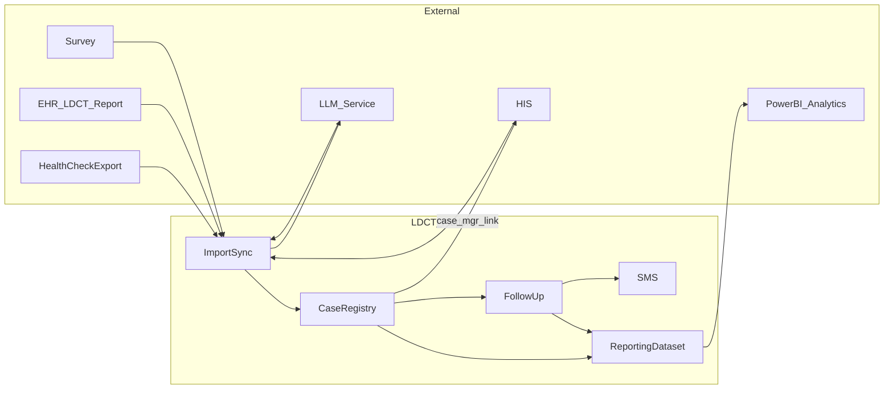

# LDCT 個案管理系統 — 系統設計（SD）

## 1. 文件目的與範圍

本文件為 **系統設計（System Design）** 層級說明，描述邏輯架構、整合方式、資料流、關鍵技術決策與待決議事項。**實作級 API／資料庫 schema** 於開發階段另補，並須與 OpenSpec 一致。

## 2. 設計原則

- **單一營運系統**：本平台為 LDCT 個案與追蹤之**主系統**（營運資料存放與流程）。
- **權威來源分流**：LDCT 報告欄位以 **EHR** 為準；**HIS** 就醫細節以 HIS 為準，本平台僅摘要／註記。
- **報表與視覺化外置**：統計呈現以 **Power BI** 為主，本平台提供**語意一致之報表資料集**。
- **非結構化報告**：經 **LLM** 擷取結構化欄位，並保留人工覆核與稽核軌跡。

## 3. 技術架構（TBD）

| 面向 | 決策狀態 |
|------|----------|
| 應用與資料層（後端／前端／資料庫） | **TBD**（實作前選定） |
| LLM 服務 | 院方核准之端點（地端／私有雲／受控 API） |
| Power BI | Import／DirectQuery／閘道等依院方 IT |

詳見 [openspec/project.md](../openspec/project.md)。

## 4. 邏輯架構（概念模組）

| 模組 | 職責 |
|------|------|
| Import／Sync | 健檢名單、EHR 報告、問卷等匯入與同步 |
| **LLM 擷取** 管線 | 非結構化報告 → 結構化欄位（可覆核） |
| Case Registry | 個案主檔、清單、與報告／問卷關聯 |
| Follow-up Engine | 追蹤分類、流程階段、清單與提醒 |
| SMS | 遠傳公務機整合、發送與紀錄 |
| **Reporting Dataset** | 供 Power BI 連線之檢視／API／檔案等 |
| HIS Link | 個管出站連結（非批次寫入 HIS） |

## 5. 整合架構（型態摘要）

| 介面 | 型態 | 備註 |
|------|------|------|
| 健檢名單 | 檔案匯入（CSV／Excel） | 欄位對照表版本化 |
| EHR（LDCT） | API、批次匯出、排程 | 與資料欄位定義一致 |
| LLM | HTTPS API（等） | PHI、日誌、訓練禁止須核定 |
| HIS | **出站連結**（SSO／URL 模板） | 查詢結果摘要回寫本平台 |
| 問卷 | API 或批次 | 依院方問卷系統 |
| 簡訊 | 遠傳公務機 API | `https://umc.fetnet.net` |
| Power BI | 連線**報表資料集** | 與 EHR LDCT 匯入無涉 |

## 6. 資料流（邏輯）

- `case_mgr_link`：個管自個案開啟 HIS，**出站**連結，非批次匯入。
- `ReportingDataset` → Power BI：視覺化於 Power BI 完成。

（與 `openspec/changes/add-ldct-case-management-platform/design.md` 一致。）

## 7. 關鍵設計議題

### 7.1 LLM 擷取

- 結構化欄位可直通；敘述／PDF 等走 **LLM** 與提示詞／輸出 schema。
- 人工覆核、低信心標示、模型版本與稽核軌跡。

### 7.2 Power BI

- 本平台暴露**報表資料集**；欄位字典與計算口徑（如追蹤完成率）應文件化，避免與清單邏輯衝突。
- 閘道、RLS、刷新頻率由院方 IT 與本專案共定。

### 7.3 HIS

- SSO、URL 參數（病歷號等）、連結逾時與錯誤頁；**不強制**雙向寫回 HIS。

## 8. 資安與部署（摘要）

- 傳輸加密、存取控制、稽核日誌：依院方政策與個資法。
- LLM、報表資料集是否去識別、Power BI **RLS**：待核定。
- 主機、備援、RPO／RTO：**TBD**。

## 9. 待決議事項

與 `design.md` 同步，包含但不限於：

- 技術架構與部署拓撲。
- EHR／LLM／HIS／Power BI 之介面與刷新 SLA。
- 簡訊 API 錯誤重試與範本變更流程。
- 個資遮罩與角色欄位可見性。

## 10. 與其他文件之關係

| 文件 | 角色 |
|------|------|
| [SA.md](SA.md) | 需求與業務分析 |
| [openspec/changes/.../design.md](../openspec/changes/add-ldct-case-management-platform/design.md) | OpenSpec 變更內之設計附錄 |
| `openspec/changes/.../specs/**/spec.md` | 驗收規格（SHALL／Scenario） |

## 11. 修訂紀錄

| 日期 | 摘要 |
|------|------|
| （初版） | 自 design.md 與專案脈絡彙整獨立 SD 文件 |
