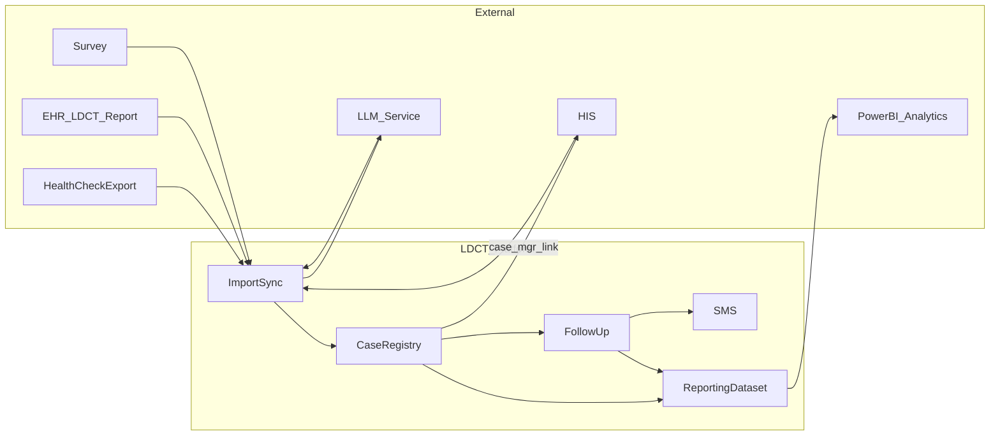

# 設計說明（補充 spec，非重複驗收條文）

## 整合型態（建議實作前定案）

| 來源 | 可能型態 | 備註 |
|------|----------|------|
| 健檢名單 | 檔案匯入（CSV／Excel） | 對應欄位對照表需版本化 |
| EHR（LDCT 報告） | API、批次匯出檔或排程同步 | 與 `data-sources` 欄位一致；RIS／PACS 影像多由院方彙整至 EHR |
| LLM 服務 | 院方核准之推理端點（地端／私有雲／受控 API） | 自報告文字／PDF 擷取結構化欄位；**PHI 傳輸、日誌、禁用於訓練**須符合資安核定 |
| 問卷系統 | API 或批次檔 | 依院方既有問卷系統能力 |
| HIS | **個管師**自本平台**連結／開啟**院內 HIS（SSO、深層連結或新視窗 URL 模板，院方定案）；查詢介面與權限以 HIS 為準；本平台記錄「查詢結果摘要」或註記（見 `follow-up-logging`） | 不強制即時雙向寫回 HIS；連結需通過資安與身分驗證評估 |
| 遠傳公務機簡訊 | `https://umc.fetnet.net` 所提供之 API／介面 | 憑證與範本由院方申請 |
| Power BI | **報表與視覺化**（月報、管理儀表等） | 連線本平台提供之**報表資料集**；與 LDCT 報告自 EHR 匯入**無涉**（見 `system-integrations`） |

## 資料落地與同步時機（院方共識）

- **LDCT 報告 → 個案清單**：以 **EHR 報告已正式發佈（已發報告／已簽署等，依院方狀態碼定義）** 為前置條件；於**發報告當日之晚間**執行**排程批次**，將報告資料**寫入本平台營運庫**（落地），並與既有個案主檔關聯，使該筆出現於 **`case-list`** 可用資料中。此時機與 [計畫書.md](../../../計畫書.md) 第二節、`data-sources` 之「LDCT 影像報告匯入」一致。
- **具體執行窗**：晚間批次之**起迄鐘點**、**時區**、**與 EHR 資料截止時間**、**假日是否遞延**、**失敗重試與告警**，於實作與院方 IT／資訊室定案並寫入設定；必要時可區為「先拉取 EHR → 再 LLM 擷取 → 再標記可列入清單」之子步驟，但**對個管可見之清單納入**仍以當晚排程完成後為準（若需人工覆核後才釋出清單，則另於 `data-sources`／作業規則註記 gate）。
- **其他來源**：健檢名單、問卷等之落地時機仍依各介接型態另行約定；與報告批次**併跑或錯開**以避免鎖表，屬實作調校項目。

## 追蹤狀態（概念）

- 個案具 **追蹤類型**（胸腔門診／3／6／12 個月）與 **流程階段**（例如：第 N 次簡訊／電訪）。
- **結案** 與 **追蹤類型** 分屬不同維度：結案代碼見 `case-closure`；未結案者於**總清單**預設篩選、儀表與報表資料集之「未結案」口徑中納入（本變更不交付獨立追蹤清單模組）。

## 個案／追蹤清單預設篩選（計算邏輯）

- **基準日**：**檢查日期**（LDCT 檢查日）。
- **追蹤欄位**（boolean／旗標，為 true 時才納入該類之日期計算）：**胸腔門診（1 個月）**、**3 months**、**6 months**、**12 months**（欄位名稱以 EHR／報告與 `data-sources` 對齊）。
- **追蹤應到日**（概念）：  
  - 胸腔門診為 true → 檢查日期 **+1 個月**  
  - 3 months 為 true → 檢查日期 **+3 個月**  
  - 6 months 為 true → 檢查日期 **+6 個月**  
  - 12 months 為 true → 檢查日期 **+12 個月**  
  月數加算之「對日」規則（如月末對齊）於實作時與院方定案並寫入設定。
- **預設篩選「本月應追蹤」**：若任一**已為 true** 類型所算出之追蹤應到日落於**當月曆月**起訖範圍內，且符合未結案等條件，則該個案於**預設**開啟清單時**顯示**；使用者可切換為自訂日期範圍或關閉預設（見 `case-list`）。

## 個案總清單列尾連結（四枚按鈕）

| 按鈕標籤 | 建議對應（二擇一或並存，院方定案） |
|----------|-----------------------------------|
| **追蹤記錄** | **固定**：站內導向 **`follow-up-logging`**（該個案之追蹤紀錄檢視／登錄）；路由或畫面嵌入方式（同頁、抽屜、新分頁）依 UI 準則與 `rbac` |
| **報告查詢** | EHR／影像或報告系統之出站 URL（病歷號、檢查序號等參數）；與「檢視報告」可共用目標或分離（依權責） |
| **基本資料** | HIS、主索引或健檢系統之病人／基本資料出站連結；或站內主檔維護畫面 |
| **簡訊發送** | 導向本平台簡訊撰寫／批次流程（`sms-fetnet`）並帶入個案；或院方簡訊入口之深層連結（若有） |

- **行為**：**追蹤記錄** 屬站內 **`follow-up-logging`**，非出站 URL。其餘三枚若為出站連結，預設以 **新視窗／新分頁** 開啟，避免中斷清單工作階段；站內路由者得用抽屜、同頁或新分頁，於 UI 準則中定義。
- **設定**：各目標之 **URL 模板、SSO、Query 參數名稱** 應可設定或版本化，與 `system-integrations`、資安評估一致；無效參數時應有清楚錯誤提示（不洩露過多內部細節）。

## 追蹤紀錄（`follow-up-logging`，設計補充）

- **入口**：以 **`case-list`** 列尾**追蹤記錄**為主要入口，**必須**帶入個案識別；同頁抽屜、新分頁或獨立路由皆可，與 UI／`rbac` 定案。
- **一個案一貫**：列表僅呈現目前個案之紀錄；頁首至少**病歷號、姓名、檢查日期**與總清單一致。
- **一筆紀錄的語意**：追蹤軌道（對齊胸腔門診／3／6／12 個月等）、聯繫類型（簡訊／電訪／其他）、**聯繫日期**、選填**聯繫結果**、**敘述內容**；並附 **建立者／建立時間**；補正時 **修改者／修改時間** 與可追溯之前值（實作策略見 spec）。
- **與簡訊**：成功發送之 **`sms-fetnet`** 應與追蹤紀錄**對應**（自動寫入一筆或一鍵寫入並帶發送紀錄 ID），避免「發了簡訊但追蹤欄位無從對照」。
- **與 HIS**：紀錄內可附 **HIS 查詢摘要**（與出站連結分離；連結見 `system-integrations`），便於稽核「曾查、查到什么」。

## LLM 擷取管線（概念）

- EHR 取得之 LDCT 報告若已為結構化欄位，可直接對應寫入；若為**敘述／PDF／需 OCR**，則送入 **LLM** 依提示詞與院方欄位定義抽取 JSON 或等價結構。
- **人工覆核**：預設或依規則要求個管／醫師確認後才視為「已驗證」並驅動追蹤分類（閾值與流程於實作與院方共定）。
- **稽核**：保留模型版本、輸入摘要長度或雜湊（避免重存全文若院方禁止）、LLM 輸出與人工修正差異。

## Power BI 與報表資料集（概念）

- 本平台維護營運資料庫（或匯出檔），並暴露**語意一致之報表資料集**（檢視、API、CSV、或 OData 等，院方定案）。
- **Microsoft Power BI** 透過閘道或直接連線取得資料集，由資訊單位或管理者建立語意模型、DAX 量值、月報與儀表板；**圖表類型與版面以 Power BI 為準**。
- 建議文件化：欄位字典、追蹤完成率之分子分母定義、與本平台清單篩選之對應，避免口徑歧義。

## 資料流（摘要）

（`case_mgr_link`：個管師自個案畫面開啟 HIS 以確認門診／手術等；為**出站**連結，非批次匯入。`ReportingDataset` 供 Power BI 連線；視覺化在 Power BI 完成。）

## 專案結構與部署（雛型／目標）

- **雛型**：**單一解決方案或 Git 儲存庫**內 **前後端分離**—實作目錄為 **`src/Api`** 與 **`src/Web`**（**後端** **ASP.NET Core Web API**；**前端** **Vue 3 + TypeScript**，靜態產物可由 **nginx** 提供）。開發時並行 `dotnet run --project src/Api` 與 `npm run dev`（`src/Web`，Vite proxy 至 API）；**`docker-compose.yml`** 提供 **SQL Server** + **API** 雛型；**`k8s/`** 為 **Kubernetes** 範例；**`.github/workflows/ci.yml`** 建置後端與前端。
- **生產目標**：**Kubernetes**；典型為 **前端 Deployment**（**nginx** 或同等提供 SPA）與 **API Deployment**，共用 **Ingress**；資料庫 **SQL Server** 可為院方受管實例或叢集外服務，連線字串經 **Secret**／**External Secrets** 注入。**HPA**、**PodDisruptionBudget**、備援與 **RPO／RTO** 與院方 IT 定案。

## 待決議事項

- **實作已定**：雛型為 **單一 repo 內 Web API + Vue 3（TypeScript）前後端分離**；資料庫 **Microsoft SQL Server**；**生產部署目標為 Kubernetes**（與 [計畫書.md](../../../計畫書.md) 第四節、`openspec/project.md` 一致）。**尚待定案**：映像策略（前端／後端分離或合併）、**Ingress**／TLS 供應商、與院方既有 **K8s**／**SQL** 落地規範。
- 叢集拓撲、備援與備份 **RPO／RTO**。
- **EHR** 取得 LDCT 報告之介面規格（API、檔案格式、錯誤重試）；**排程節奏**已與計畫書對齊為「**已發報告當日之晚間批次**」，細部鐘點與窗長仍待與院方定案。
- **LLM**：模型選型、地端／雲端、提示詞與輸出 schema、信心閾值、**PHI 最小化**與失敗時純人工路徑。
- **HIS**：SSO 與否、URL 參數（病歷號／病人 ID）、連結逾時與錯誤頁處理。
- **Power BI**：連線方式（閘道、Import／DirectQuery）、工作區權限、資料集刷新頻率與 SLA。
- 簡訊 API 錯誤重試、退件處理與範本變更流程。
- 個資欄位遮罩規則（依角色）；**報表資料集**是否需去識別或列級安全（RLS）於 Power BI 側設定。
