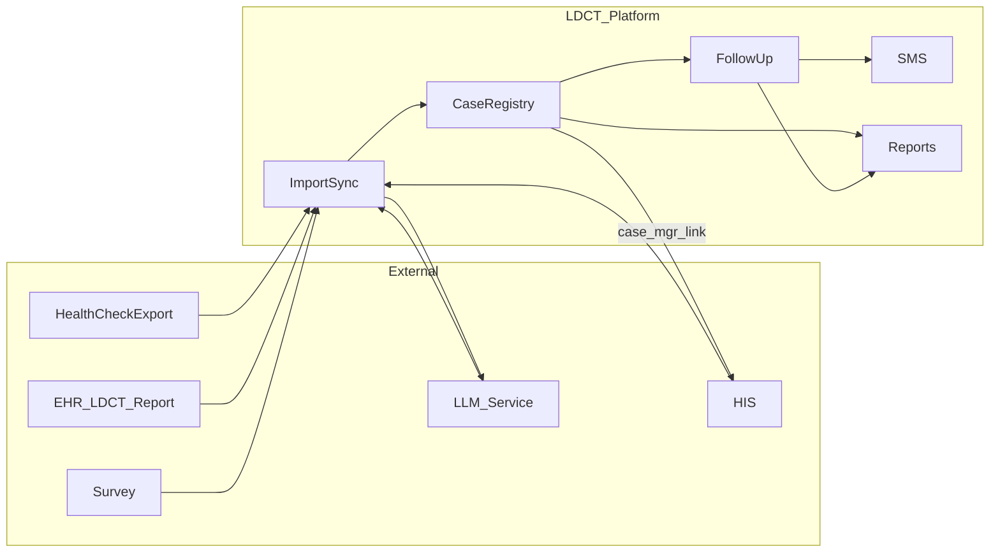

# 設計說明（補充 spec，非重複驗收條文）

## 整合型態（建議實作前定案）

| 來源 | 可能型態 | 備註 |
|------|----------|------|
| 健檢名單 | 檔案匯入（CSV／Excel） | 對應欄位對照表需版本化 |
| EHR（LDCT 報告） | API、批次匯出檔或排程同步 | 與 `data-sources` 欄位一致；RIS／PACS 影像多由院方彙整至 EHR |
| LLM 服務 | 院方核准之推理端點（地端／私有雲／受控 API） | 自報告文字／PDF 擷取結構化欄位；**PHI 傳輸、日誌、禁用於訓練**須符合資安核定 |
| 問卷系統 | API 或批次檔 | 依院方既有問卷系統能力 |
| HIS | **個管師**自本平台**連結／開啟**院內 HIS（SSO、深層連結或新視窗 URL 模板，院方定案）；查詢介面與權限以 HIS 為準；本平台記錄「查詢結果摘要」或註記（見 `follow-up-logging`） | 不強制即時雙向寫回 HIS；連結需通過資安與身分驗證評估 |
| 遠傳公務機簡訊 | `https://umc.fetnet.net` 所提供之 API／介面 | 憑證與範本由院方申請 |

## 追蹤狀態（概念）

- 個案具 **追蹤類型**（胸腔門診／3／6／12 個月）與 **流程階段**（例如：第 N 次簡訊／電訪）。
- **結案** 與 **追蹤類型** 分屬不同維度：結案代碼見 `case-closure`；未結案者列入各追蹤清單統計。

## LLM 擷取管線（概念）

- EHR 取得之 LDCT 報告若已為結構化欄位，可直接對應寫入；若為**敘述／PDF／需 OCR**，則送入 **LLM** 依提示詞與院方欄位定義抽取 JSON 或等價結構。
- **人工覆核**：預設或依規則要求個管／醫師確認後才視為「已驗證」並驅動追蹤分類（閾值與流程於實作與院方共定）。
- **稽核**：保留模型版本、輸入摘要長度或雜湊（避免重存全文若院方禁止）、LLM 輸出與人工修正差異。

## 資料流（摘要）

（`case_mgr_link`：個管師自個案畫面開啟 HIS 以確認門診／手術等；為**出站**連結，非批次匯入。）

## 待決議事項

- 技術棧、主機環境、備援與備份 RPO／RTO。
- **EHR** 取得 LDCT 報告之介面規格（API、檔案格式、排程頻率、錯誤重試）。
- **LLM**：模型選型、地端／雲端、提示詞與輸出 schema、信心閾值、**PHI 最小化**與失敗時純人工路徑。
- **HIS**：SSO 與否、URL 參數（病歷號／病人 ID）、連結逾時與錯誤頁處理。
- 簡訊 API 錯誤重試、退件處理與範本變更流程。
- 個資欄位遮罩規則（依角色）。
